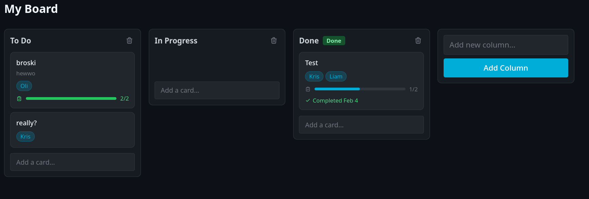
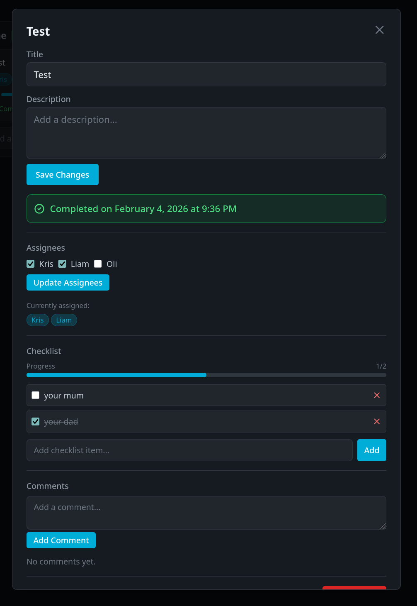

# Krizzy

Lightweight Kanban board built with Go, Echo, Templ, Datastar, and SQLite.




## Requirements

- Go 1.21+

## Run

```bash
make run
```

Open http://localhost:8080

## Build

```bash
make build
./bin/krizzy
```

## Configuration

| Env Variable | Default | Description |
|--------------|---------|-------------|
| `SERVER_ADDRESS` | `:8080` | Server listen address |
| `DATABASE_PATH` | `krizzy.db` | SQLite database path |
