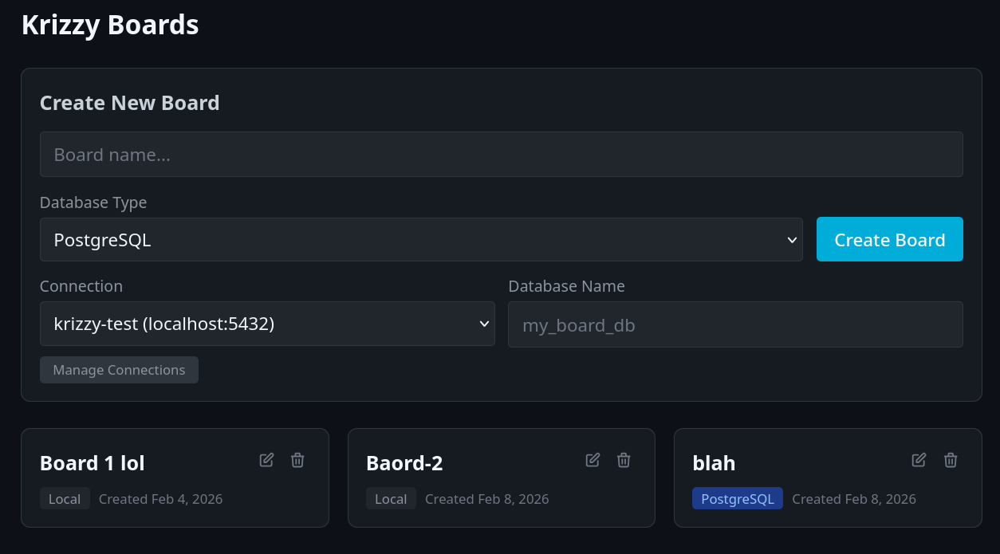
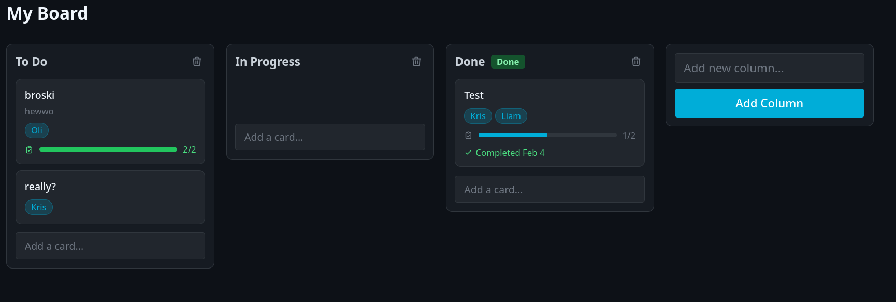
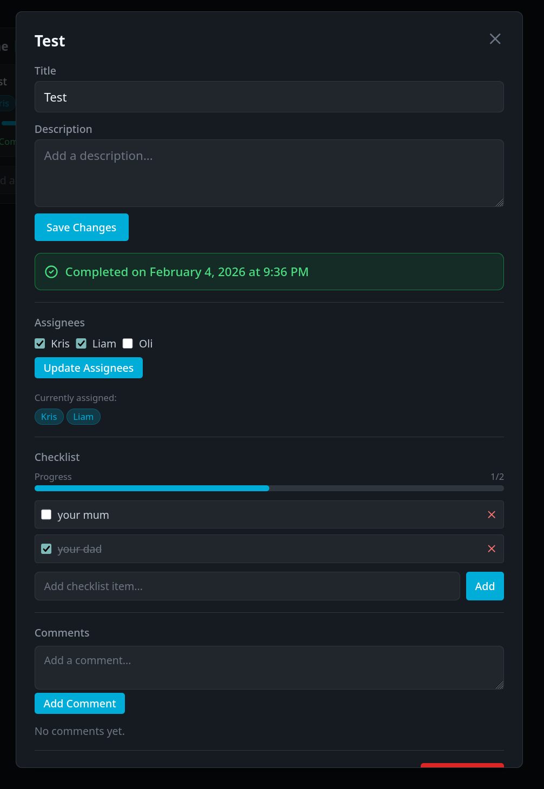

# Krizzy

Lightweight Kanban board built with Go, Echo, Templ, Datastar, and SQLite.





## Requirements

- **Go 1.21+** - Required for building and running the app
- **Node.js + npm** - Optional, for building Tailwind CSS locally (uses CDN by default)

## Run

```bash
make run
```

Open http://localhost:8080

## Build

```bash
make build
./bin/krizzy
```

## Docker

Krizzy is best deployed as a single self-hosted container with a persistent SQLite volume.

Minimal startup:

```bash
make docker-build
make docker-up
```

Then open `http://localhost:8080` on the same machine, or `http://<server-ip>:8080` from another device on your network.

If you are deploying on a VM or homelab server, make sure port `8080` is allowed by the host firewall or cloud security rules.

Useful commands:

```bash
make docker-logs
make docker-down
```

These Make targets use plain `docker build` and `docker run`, so they work even on systems that do not have Docker Compose installed.

The SQLite database is stored in the named Docker volume `krizzy-data`, mounted at `/data`, and the app exposes a health endpoint at `/healthz` for container health checks.

If you want to run the image directly instead of Compose:

```bash
docker build -t krizzy .
docker run -d \
  --name krizzy \
  -p 8080:8080 \
  -e SERVER_ADDRESS=:8080 \
  -e DATABASE_PATH=/data/krizzy.db \
  -v krizzy-data:/data \
  --restart unless-stopped \
  krizzy
```

This deployment mode is intentionally single-node. The app uses SQLite for local board storage and an in-memory SSE broadcaster for real-time updates, so running multiple replicas behind a load balancer is not recommended without adding shared storage and shared event fanout.

If you prefer Compose and your Docker install supports it, `compose.yaml` is also included.

## Postgres (optional)

Boards can optionally be backed by Postgres instead of SQLite. A Docker container is included for local development (requires Docker and may need `sudo`):

```bash
make pg-up      # start Postgres in background
make pg-down    # stop Postgres
make pg-reset   # stop Postgres and wipe data
```

Once Postgres is running, click **Manage Connections** on the boards page and add a connection with host=`localhost`, port=`5432`, user=`krizzy`, password=`krizzy`. Then create a new board and select "PostgreSQL" as the database type.

## Configuration

| Env Variable | Default | Description |
|--------------|---------|-------------|
| `SERVER_ADDRESS` | `:8080` | Server listen address |
| `DATABASE_PATH` | `krizzy.db` | SQLite database path |
